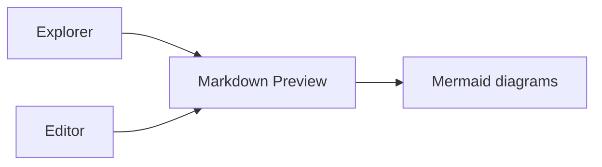
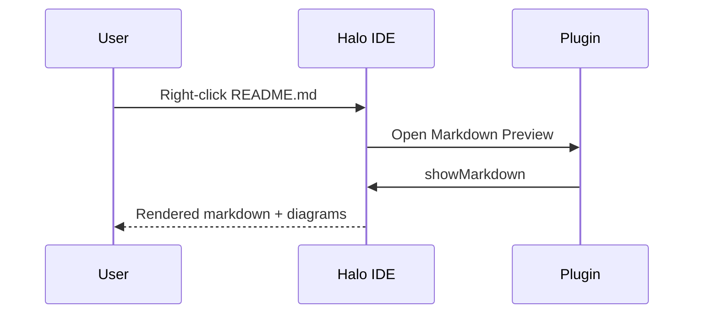
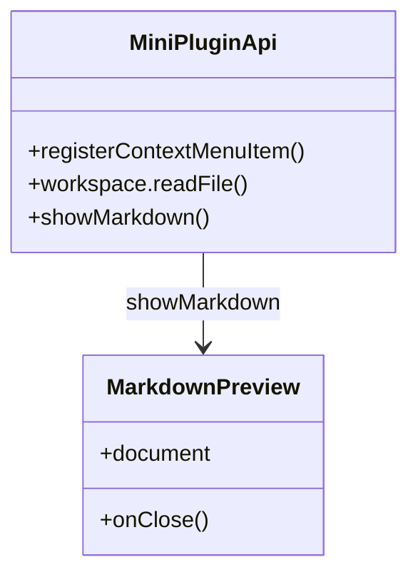

# Diagrams

Right-click this file and choose **Open Markdown Preview**.

## Flowchart

```mermaid
flowchart LR
  explorer[Explorer] --> preview[Markdown Preview]
  editor[Editor] --> preview
  preview --> mermaid[Mermaid diagrams]
```

## Sequence

```mermaid
sequenceDiagram
  participant User
  participant Halo as Halo IDE
  participant Plugin
  User->>Halo: Right-click README.md
  Halo->>Plugin: Open Markdown Preview
  Plugin->>Halo: showMarkdown
  Halo-->>User: Rendered markdown + diagrams
```

## Class

```mermaid
classDiagram
  class MiniPluginApi {
    +registerContextMenuItem()
    +workspace.readFile()
    +showMarkdown()
  }
  class MarkdownPreview {
    +document
    +onClose()
  }
  MiniPluginApi --> MarkdownPreview : showMarkdown
```
